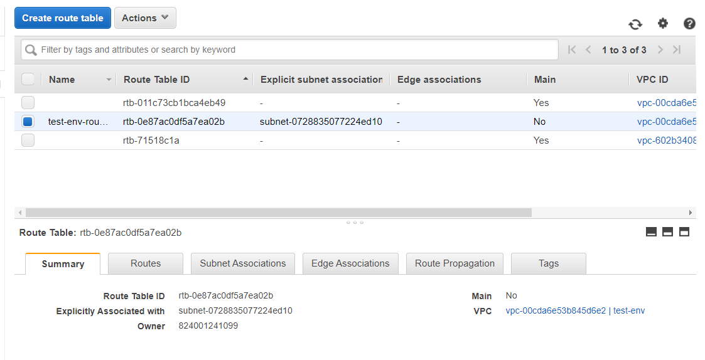

# task3-terraform
# Problem Statement

We have to create a web portal for our company with all the security as much as possible.
So, we use Wordpress software with dedicated database server.
Database should not be accessible from the outside world for security purposes.
We only need to public the WordPress to clients.
So here are the steps for proper understanding!

Steps:
1) Write a Infrastructure as code using terraform, which automatically create a VPC.

2) In that VPC we have to create 2 subnets:
    a)  public  subnet [ Accessible for Public World! ] 
    b)  private subnet [ Restricted for Public World! ]

3) Create a public facing internet gateway for connect our VPC/Network to the internet world and attach this gateway to our VPC.

4) Create  a routing table for Internet gateway so that instance can connect to outside world, update and associate it with public subnet.

5) Launch an ec2 instance which has Wordpress setup already having the security group allowing  port 80 so that our client can connect to our wordpress site.
Also attach the key to instance for further login into it.

6) Launch an ec2 instance which has MYSQL setup already with security group allowing  port 3306 in private subnet so that our wordpress vm can connect with the same.
Also attach the key with the same.

Note: Wordpress instance has to be part of public subnet so that our client can connect our site. 
mysql instance has to be part of private  subnet so that outside world can't connect to it.
Don't forgot to add auto ip assign and auto dns name assignment option to be enabled.

Try each step first manually and write Terraform code for the same.
This will give u proper understanding of workflow of task.
And the task is complete. 

## Solution for this problem is:
 

### Step 1: Write a Infrastructure as code using terraform, which automatically create a VPC.


### Step 2: In that VPC we have to create 2 subnets:
* public  subnet [ Accessible for Public World! ] 
* private subnet [ Restricted for Public World! ]


### Step 3: Create a public facing internet gateway for connect our VPC/Network to the internet world and attach this gateway to our VPC.


### Step 4: Create  a routing table for Internet gateway so that instance can connect to outside world, update and associate it with public subnet.



### Step 5: Launch an ec2 instance which has Wordpress setup already having the security group allowing  port 80 so that our client can connect to our wordpress site.
Also attach the key to instance for further login into it.


### Step 6: Launch an ec2 instance which has MYSQL setup already with security group allowing  port 3306 in private subnet so that our wordpress vm can connect with the same.
Also attach the key with the same.


## Extra:

### After putting these code in one file of .tf extension run this file

* For this you have to install the terraform

* Then ```aws configure```

* Then, ```terraform inti```

* Then, ```terraform plan or terraform ```

* Finally run the file ```terraform apply -auto-approve```


* If want to destroy the environment ```terraform destroy -auto-approve```


## Output:


* Since you have seen on mysql instance there is public ip but it cant be accessible from anywhere.


## Built With

* Terraform
* AWS

## Author

[SAURAV PATEL](https://www.linkedin.com/in/saurav-patel-148539151/)
